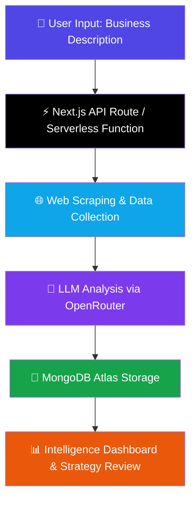

<!-- Banner -->
<div align="center">

```
███╗   ███╗ █████╗ ██████╗ ██╗  ██╗███████╗████████╗    ██████╗ ██╗   ██╗██╗     ███████╗███████╗    █████╗ ██╗
████╗ ████║██╔══██╗██╔══██╗██║ ██╔╝██╔════╝╚══██╔══╝    ██╔══██╗██║   ██║██║     ██╔════╝██╔════╝   ██╔══██╗██║
██╔████╔██║███████║██████╔╝█████╔╝ █████╗     ██║       ██████╔╝██║   ██║██║     ███████╗█████╗     ███████║██║
██║╚██╔╝██║██╔══██║██╔══██╗██╔═██╗ ██╔══╝     ██║       ██╔═══╝ ██║   ██║██║     ╚════██║██╔══╝     ██╔══██║██║
██║ ╚═╝ ██║██║  ██║██║  ██║██║  ██╗███████╗   ██║       ██║     ╚██████╔╝███████╗███████║███████╗   ██║  ██║██║
╚═╝     ╚═╝╚═╝  ╚═╝╚═╝  ╚═╝╚═╝  ╚═╝╚══════╝   ╚═╝       ╚═╝      ╚═════╝ ╚══════╝╚══════╝╚══════╝   ╚═╝  ╚═╝╚═╝
```

### 📈 Autonomous Competitor Intelligence & Strategy Analysis Platform

[](https://dev-season-of-code.devpost.com/?_gl=1*vwdmbv*_gcl_au*ODA0MTE0NzMxLjE3NzMyMDk1ODg.*_ga*MTk5MDUyODMwOS4xNzczMjA5NTg5*_ga_0YHJK3Y10M*czE3NzM1ODMxMzEkbzIxJGcxJHQxNzczNTgzMTk1JGo1NiRsMCRoMA..)
[](https://nextjs.org/)
[](https://www.typescriptlang.org/)
[](https://tailwindcss.com/)
[](https://www.mongodb.com/atlas)
[](https://openrouter.ai/)
[](https://vercel.com/)

### 🌐 [**Live Demo → marketpulse-ai-taupe.vercel.app**](https://marketpulse-ai-taupe.vercel.app)

</div>

---

## 🚀 Overview

**MarketPulse AI** is an intelligent market intelligence platform that automatically discovers competitors, analyzes market signals, and generates strategic insights. Built for modern startups and founders, it leverages a **fully serverless Next.js 14 architecture** — no traditional backend required — to transform fragmented web data into actionable business intelligence.

> 💡 Describe your business. Let the AI do the rest.

---

## ⚠️ The Problem

In today's fast-paced digital economy, pricing strategies and competitor activity change overnight.

| Pain Point | Reality |
|---|---|
| 🐢 **Manual Research is Slow** | Browsing news and marketplaces manually is time-consuming and fragmented |
| 🕳️ **Data Incompleteness** | Critical market signals are missed without continuous monitoring |
| 🤯 **Analysis Paralysis** | Converting raw data into a concrete "next move" is difficult without structured AI analysis |

---

## 💡 The Solution

MarketPulse AI automates the entire intelligence lifecycle through an **autonomous AI pipeline** running on Next.js API Routes (Serverless Functions). It doesn't just find data — it **understands it**.

By scraping real-time web information and processing it through advanced LLMs via OpenRouter, the platform delivers structured reports that allow businesses to **react instantly** to market shifts.

---

## ✨ Key Features

- 🔍 **Autonomous Discovery** — Describe your business; the AI-driven serverless worker finds competitors instantly
- 📊 **AI Intelligence Reports** — Deep-dive analysis including sentiment, SWOT, and actionable strategic recommendations
- 📡 **Real-time Activity Feed** — Live monitoring system showing ongoing market analysis tasks
- 🎯 **Strategy Analyzer** — Test your business strategies against gathered intelligence for optimization
- 🔭 **Competitor Watchlist** — Track specific companies and receive continuous updates on their market signals

---

## ⚙️ System Workflow



---

## 🛠️ Tech Stack

### Framework & UI

| Technology | Purpose |
|---|---|
| **Next.js 14** (App Router) | Full-stack framework — frontend + serverless API routes |
| **Vercel** | Serverless deployment platform |
| **TypeScript** | Type-safe development |
| **TailwindCSS + Shadcn/UI** | Styling & component library |

### Data & Intelligence

| Technology | Purpose |
|---|---|
| **MongoDB Atlas** | NoSQL cloud database for storing intelligence reports |
| **OpenRouter LLM APIs** | AI orchestration & analysis engine |
| **Web Scraping** | Automated data collection from live web sources |

> ⚠️ **Architecture Note:** This project uses **no dedicated backend server**. All server-side logic runs through **Next.js API Routes** as serverless functions, deployed on Vercel. MongoDB Atlas serves as the persistence layer.

---


## 🚀 Getting Started

### Prerequisites

- Node.js 18+
- MongoDB Atlas account
- OpenRouter API key
- Apify Router Key 

### Installation

```bash
# 1. Clone the repository
git clone https://github.com/dc-codes/marketpulse-ai.git
cd marketpulse-ai

# 2. Move to the dashboard-next 
cd dashboard-next

# 3. Install dependencies
npm install

# 4. Set up environment variables
cp .env.example .env.local
```

### Environment Variables

Create a `.env.local` file in the root directory:

```env
# MongoDB Atlas
MONGODB_URI=your_mongodb_atlas_connection_string

# OpenRouter AI
OPENROUTER_API_KEY=your_openrouter_api_key

# App
NEXTAUTH_SECRET=your_secret_here

```

### Run the Development Server

```bash
bun dev
```

Open [http://localhost:3000](http://localhost:3000) in your browser.

---

## 🎥 Demo

> 🎬 **[Watch the Demo Video](https://youtu.be/DpAZw3KAC9Q)** — See MarketPulse AI in action

---

## 🏆 Hackathon Submission

This project was developed for the **Dev Season of Code (DSOC) Hackathon**.

### Primary Themes

| Theme | Description |
|---|---|
| 🤖 **AI & Machine Learning** | LLM-powered competitor analysis & sentiment detection |
| 📈 **Data Science & Analytics** | Real-time market signal extraction and business insight generation |
| 💼 **AI-Driven Commercial Systems** | Autonomous decision-support systems for founders & startups |

---

## 🤝 Contributing

Contributions, issues and feature requests are welcome! Feel free to check the [issues page](#).

---

## 📄 License

This project is licensed under the MIT License — see the [LICENSE](LICENSE) file for details.

---

<div align="center">

Developed with ❤️ by **c0d3l0v3r**

*MarketPulse AI — Know your market before your competitors do.*

</div>